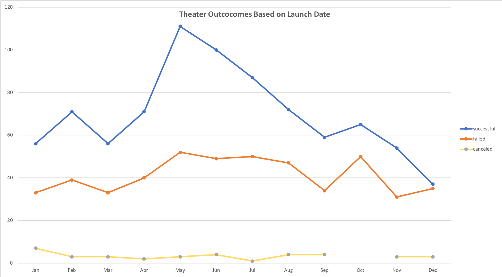
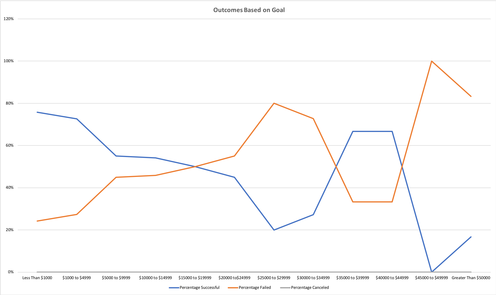

# Kickstarting with Excel

## Overview of Project

### Louise came close to meeting her fundraising goal for her play, *Fever*, in a short amount of time. The goal of this analysis report is to provide her with information on the outcomes of different campaigns in relation to their launch dates and their funding goals. 
## Analysis and Challenges

### Analysis of Outcomes Based on Launch Date
In order to perform analysis of outcomes based on launch dates, I  began by creating a new column to provide the year the campaign was created, using the function, YEAR(). From there, I created a pivot table and filted the table to show data based on the parent category and year. To extract the data for this analysis, I filtered the table to only show successful, failed, and canceled theater campiagns. I used this filtered date created a line graph, visualizing the theature outcomes based on launch date. The graph breaks down the year to show the outcome of the campaings within each month. 

### Analysis of Outcomes Based on Goals
It was also important to analyze the outcomes of the campaigns based on their funding goals. For this analysis, I filtered the data to only display play campaigns. In a new sheet, I created a table that sorted each play outcome based on the campaign goal. The goals were sorted in incriments of of $5,000, with "less than $1,000" being the baseline. I then used the COUNTIFS function to collect the data from the Kickstarter sheet, filtering the outcome and subcatergory. I was able to extract the data, giving me a look into the outcome of each range of funding goals. To help make the data more concise for visualization, I converted the data into percentages: percantage successful, percentage failed, and percantage canceled. The graph below shows the percentage of failed and successful play campaigns based on the funding goal. 

### Challenges and Difficulties Encountered
While I only encountered one challenge creating this analysis, there are a few other possible challeges or difficulties that I could've encountered. The one thing that did challenge me was learning how to use excel functions that I did not have prior experience with. It was a lot of trial and error inputing the correct syntax for the fumction and insuring that it was the correct output. Like anything else, it takes practice and making mistakes to learn to do something correctly. Also, I believe that with a data set this large, it can be challenging to know where to start and which specifc information to pull. This could lead to errrors and misanalysis of the data at hand. 
## Results
- What are two conclusions you can draw about the Outcomes based on Launch Date? 

Based on the results of the graph, theater campaigns launched between May and July were more successful then those during the rest of the year, while failed theature campaigns remain fairly consistent throughout the year and increasing a small amount in May. We can also conclude that the launch date of a campaign had little to no effect on whether the production failed or was cancelled. Yet, we can conclude that campaigns launched in the summer months had a greater chance for a successful outcome. 

- What can you conclude about the Outcomes based on Goals?

We can condclude that there is an inverse relationship between goal and outcome. From the graph, we see that play campaigns were much more successful when the funding goal was low. For campaigns with a funding goal under $5,000, the rate of succession was averaging between 72-75%, with failed campaigns at around 25%. As the funding goal increased, the percentage of succcesion decreased. However, we can see an increase of success at a funding goal of $35,000 to $40,000. 

- What are some limitations of this dataset?

One limitation to this set of data is the absence of the location of the campaign. While we know the country of origin, I feel that it too broad when anaylzing the outcomes in comparrison to their funding goals. It would be useful to know the city where the campaign launched, this way we have knowledge of the population, spread of wealth, ethinicity, etc. Without this information, our data and results could be misinterpreted due to the lack of control in the data set. 

- What are some other possible tables and/or graphs that we could create? 

Another element that would've been helped to add to this report would be a table of descriptive statistics. This table would be helpful to visulize the data as a whole and a gereral understanding of the standard for outcome vs goal. The table would include the mean, median, standard deviation, upper quartile, lower quartile, and IQR. These statistics give perspective into the spread of the data, in terms of the average outcomes in relation to their funding goal and pledge amount.  
